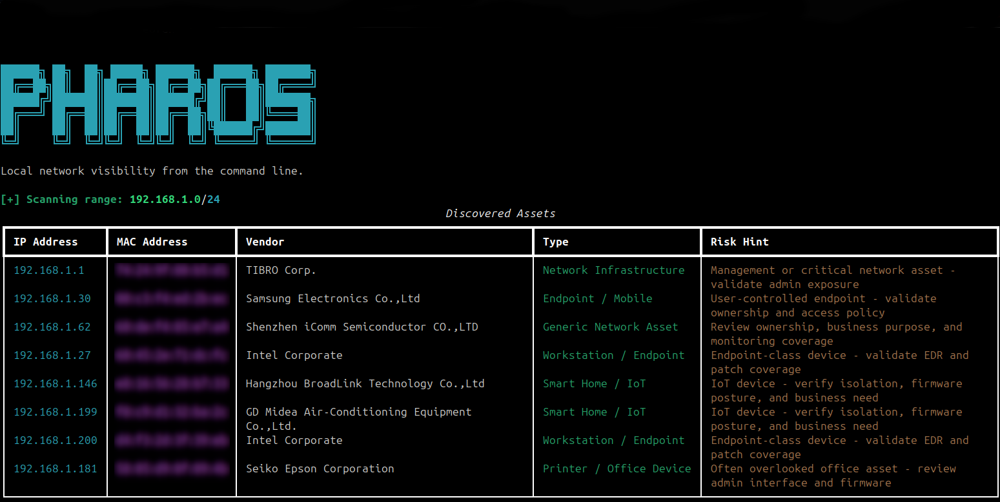
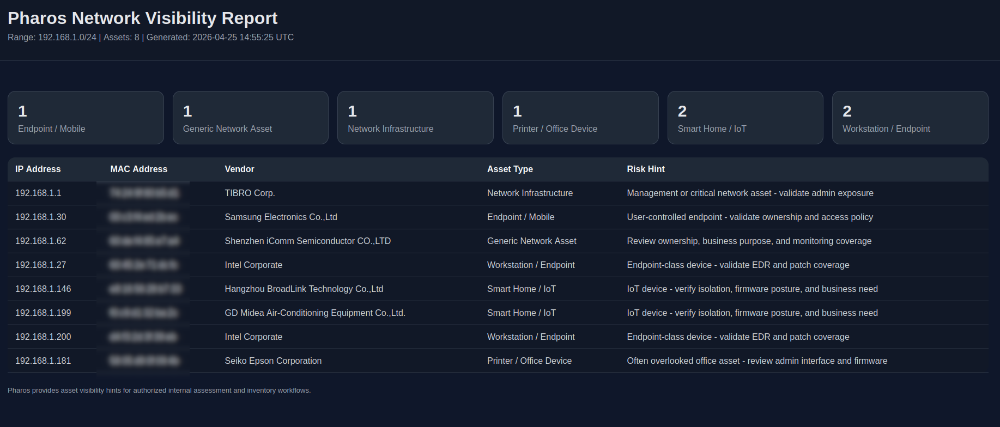

# Pharos

[](https://www.python.org/)
[](LICENSE)
[](#responsible-use)
[](#roadmap)

**CLI-based local network visibility for defensive asset discovery and reporting.**

Pharos is a lightweight command-line tool by **Audax Cybersecurity** for authorized local network asset visibility, inventory enrichment, and evidence-ready reporting.

It helps security teams, administrators, auditors, and lab operators quickly understand what devices are present on a local network, enrich observed assets with vendor information, classify common device categories, identify IoT hints, and export results to terminal, JSON, CSV, or HTML.

## Why Pharos

Before hardening, validation, or cyber resilience planning, teams need to answer a basic question:

> What actually exists inside the network?

Pharos provides a practical first visibility layer for defensive assessment workflows.

It focuses on asset awareness, not exploitation.

## About Audax Cybersecurity

Audax Cybersecurity develops AI-driven Adversary Intelligence and Cyber Resilience solutions for organizations that need to connect threat intelligence, technical defense, validation, and executive resilience documentation into a unified operational model.

Pharos is a limited open-source utility released by Audax Cybersecurity to support authorized visibility, asset awareness, and defensive assessment workflows.

Audax Cybersecurity's commercial work extends beyond this tool and includes enterprise-grade adversary intelligence, validation workflows, executive reporting, cyber resilience evidence management, and tailored security services for organizations with higher assurance requirements.

## Features

- ARP-based local network discovery
- MAC vendor enrichment
- Improved asset classification
- IoT and smart-device detection hints
- Risk hints for common device categories
- Clean terminal table output
- JSON export
- CSV export
- Standalone HTML report generation
- Python packaging with a CLI entry point
- Basic automated tests

## Screenshots

Recommended screenshot placeholders are documented in [`docs/screenshots/README.md`](docs/screenshots/README.md).

Before uploading screenshots, remove or mask real client names, public IP addresses, internal hostnames, sensitive MAC addresses, and production network details.

```markdown


```

## Example Terminal Output

```text
PHAROS - Local Network Visibility CLI

[+] Scanning range: 192.168.1.0/24

Discovered Assets
IP Address      MAC Address          Vendor                               Type                    Risk Hint
192.168.1.1     74:24:9f:80:b5:d1    TIBRO Corp.                          Network Infrastructure  Management or critical network asset - validate admin exposure
192.168.1.181   58:05:d9:0f:09:4b    Seiko Epson Corporation              Printer / Office Device Often overlooked office asset - review admin interface and firmware
192.168.1.199   f0:c9:d1:32:ba:2c    GD Midea Air-Conditioning Equipment  Smart Home / IoT        IoT device - verify isolation, firmware posture, and business need
```

## Installation

Run the installation commands from the repository root, not from inside the `pharos/` package directory.

```bash
git clone https://github.com/AudaxCybersecurity/pharos-cli.git
cd pharos-cli
python3 -m venv venv
source venv/bin/activate
pip install --upgrade pip
pip install -e .
```

Confirm the CLI is installed:

```bash
which pharos
pharos --help
```

## Usage

When using a virtual environment, `sudo pharos` may not find the command because sudo uses a different PATH. Use the executable inside the virtual environment:

```bash
cd ~/pharos-cli
source venv/bin/activate
sudo venv/bin/pharos --range 192.168.1.0/24
```

Export JSON and CSV:

```bash
sudo venv/bin/pharos --range 192.168.1.0/24 --json results.json --csv results.csv
```

Generate an HTML report:

```bash
sudo venv/bin/pharos --range 192.168.1.0/24 --html pharos-report.html
```

Generate all outputs:

```bash
sudo venv/bin/pharos --range 192.168.1.0/24 --json results.json --csv results.csv --html pharos-report.html
```

Use a custom timeout:

```bash
sudo venv/bin/pharos --range 192.168.1.0/24 --timeout 3
```

## Asset Classification

Pharos uses conservative vendor-based classification to provide quick inventory hints. It does not claim exact device identity.

Current categories include:

- Network Infrastructure
- Camera / Surveillance IoT
- Smart Home / IoT
- Printer / Office Device
- Endpoint / Mobile
- Workstation / Endpoint
- Virtualized Asset
- Embedded / Lab IoT
- Generic Network Asset
- Unknown Asset

## Project Structure

```text
pharos-cli/
├── pharos/
│   ├── __init__.py
│   ├── banner.py
│   ├── classifier.py
│   ├── cli.py
│   ├── exporters.py
│   ├── report.py
│   └── scanner.py
├── docs/
│   └── screenshots/
├── examples/
│   └── sample-output.json
├── tests/
│   └── test_classifier.py
├── .github/workflows/python.yml
├── CHANGELOG.md
├── CONTRIBUTING.md
├── LICENSE
├── ROADMAP.md
├── SECURITY.md
├── pyproject.toml
├── README.md
└── requirements.txt
```

## Development

Install development dependencies:

```bash
cd ~/pharos-cli
source venv/bin/activate
pip install -e .[dev]
```

Run tests:

```bash
pytest
```

## Roadmap

See [`ROADMAP.md`](ROADMAP.md).

Near-term focus:

- Screenshots and visual examples
- Auto subnet detection
- Interface selection
- Risk level per asset
- HTML report improvements
- Docker image

## Responsible Use

Pharos is intended for authorized internal visibility, asset inventory, lab use, and defensive assessment workflows.

Use it only in environments where you have permission.

Pharos is not an exploitation framework, payload framework, credential access tool, phishing kit, C2 framework, or offensive automation platform.

## Security

Please report security concerns through the process described in [`SECURITY.md`](SECURITY.md).

## Contributing

Contributions are welcome for defensive use cases. See [`CONTRIBUTING.md`](CONTRIBUTING.md).

## License

MIT License.
